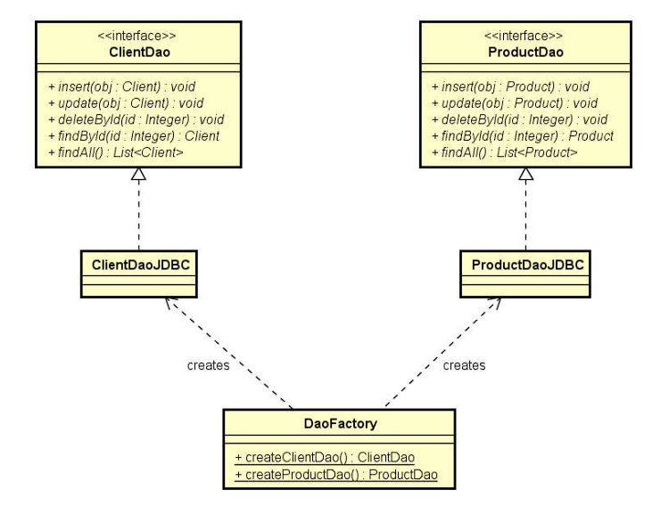
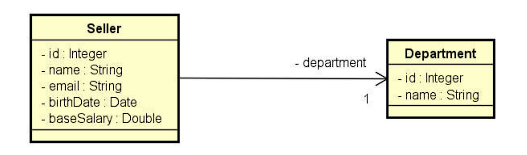
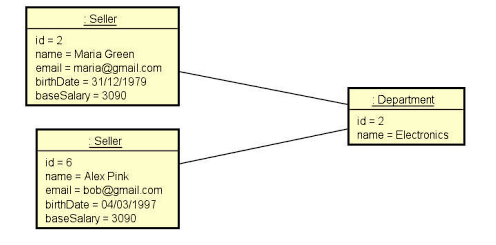

# departmentDAO

Um projeto simples em Java que implementa o padrão **DAO (Data Access Object)** para gerenciamento de departamentos (e possivelmente outros objetos de domínio) usando JDBC e banco de dados.

## Visão geral
Este projeto demonstra como separar a lógica de negócio da lógica de acesso a dados usando interfaces DAO e implementações concretas.  
O código está organizado para facilitar extensões, testes e manutenção — um ótimo laboratório para aprender boas práticas de persistência em Java.

## Funcionalidades principais
- Conexão com banco de dados (via arquivo de propriedades `db.properties`)
- Classe utilitária para gerenciar a conexão (pooling, se configurado)
- Interface DAO para entidade “Departamento” (ex: `DepartmentDao`)
- Implementação JDBC da interface DAO (`DepartmentDaoJDBC`)
- Operações CRUD (Create, Read, Update, Delete) para a entidade Departamento
- Estrutura de pacotes intuitiva (entidades, DAO, impl, util)

## Estrutura de pastas
```
src/
  model/
    entities/       # classes de entidade (ex: Department)
    dao/            # interfaces DAO (ex: DepartmentDao)
    dao/impl/       # implementações das interfaces (ex: DepartmentDaoJDBC)
  db.properties      # arquivo de configuração de conexão com BD
.gitignore
.idea/
… (outros arquivos de configuração)  
```

## Representação UML DaoFactory


## Relacionamento vendedor -> departamento



## Tecnologias utilizadas
- Java (versão compatível no projeto)
- JDBC (Java Database Connectivity)
- Banco de dados relacional (MySQL, PostgreSQL ou outro, conforme configuração)
- (Opcional) IDE como IntelliJ IDEA ou Eclipse

## Como configurar e executar
1. Clone o repositório:
   ```bash
   git clone https://github.com/AllissonCamargo/departmentDAO.git
   ```  
2. Abra o projeto em sua IDE favorita.
3. Configure o arquivo `db.properties` com os parâmetros adequados do seu banco de dados. Por exemplo:
   ```
   dburl=jdbc:mysql://localhost:3306/seu_banco
   user=seu_usuario
   password=sua_senha
   ```  
4. Certifique-se de ter o driver JDBC correspondente ao seu banco (por exemplo `mysql-connector-java` para MySQL).
5. Compile o projeto e execute a classe principal (caso exista) ou testes manuais de DAO.
6. Use as interfaces DAO para executar operações no banco (inserir, consultar, atualizar, excluir).

## Boas práticas e conceitos destacados
- O padrão DAO permite que a lógica de acesso a dados mude sem impactar a lógica de negócio. ([baeldung.com](https://www.baeldung.com/java-dao-pattern?utm_source=chatgpt.com))
- Separação de camadas: entidade → interface DAO → implementação DAO → uso da DAO pela aplicação.
- Configuração externa do banco (via `db.properties`) para evitar hard‑code de credenciais ou URLs.
- Uso de pacotes para modularização do código, tornando mais simples manter e evoluir.

## Possíveis melhorias futuras
- Inserir classes de teste (JUnit) para validar comportamentos dos DAOs.
- Adicionar logging (ex: SLF4J + Logback).
- Implementar um pool de conexões (ex: HikariCP) para performance.
- Suportar múltiplas entidades além de “Department” (ex: “Employee”, “Project”).
- Migrar para uso de framework ORM como Hibernate ou Spring Data JPA para exemplificar versão mais “industrial”.
- Externalizar transações e tratamento de exceções de banco de dados.
- Documentar diagramas (UML) de entidade/DAO, e criar README mais detalhado com exemplos de uso.

## Contribuindo
Fique à vontade para contribuir: abrir issues, enviar pull requests, sugerir novas funcionalidades ou melhorias de código. Por favor, siga o estilo de código do projeto.

## Licença
Indique a licença do projeto (ex: MIT, Apache 2.0) ou adicione um arquivo `LICENSE` conforme desejado.
